# OpsRelay user guide

What OpsRelay looks like in use, step by step, why it's useful, and where it could go next.

Every screenshot below is from a real run of v0.2: `opsrelay up` with the agents on **Amazon
Nova 2 Lite** through Amazon Bedrock. Nothing was scripted or edited; the agents wrote every
sentence you see. (To install and start OpsRelay, see [WALKTHROUGH.md](WALKTHROUGH.md).)


## Contents

- [The workflow in pictures](#the-workflow-in-pictures)
  - [1. The console](#1-the-console)
  - [2. An alert fires and the agents take over](#2-an-alert-fires-and-the-agents-take-over)
  - [3. What happened, and why](#3-what-happened-and-why)
  - [4. What OpsRelay wants to do, and who must approve it](#4-what-opsrelay-wants-to-do-and-who-must-approve-it)
  - [5. Fixed, verified and written up](#5-fixed-verified-and-written-up)
  - [6. What the agents actually did](#6-what-the-agents-actually-did)
  - [7. When a person says no](#7-when-a-person-says-no)
  - [8. When the policy says a person isn't needed](#8-when-the-policy-says-a-person-isnt-needed)
- [How the governance layer works](#how-the-governance-layer-works)
- [How to use it](#how-to-use-it)
- [Why it's useful](#why-its-useful)
- [How it could be improved](#how-it-could-be-improved)

## The workflow in pictures

The incident panel on the right answers an operator's questions in the order they ask them:
**what happened → why → what OpsRelay wants to do → does a person need to approve it → what the
agents did → can the record be trusted → what we learned.**

### 1. The console


- **Trigger a scenario** injects a realistic fault into the simulated environment, as if an alert
  had fired: a bad deploy, a memory leak or a traffic spike.
- **You (approver)** is your name. Every approval or rejection is recorded with it.
- **Service health** shows the six simulated services, their error rate and p99 latency.
- **Incidents** lists every incident with its status and severity.

### 2. An alert fires and the agents take over

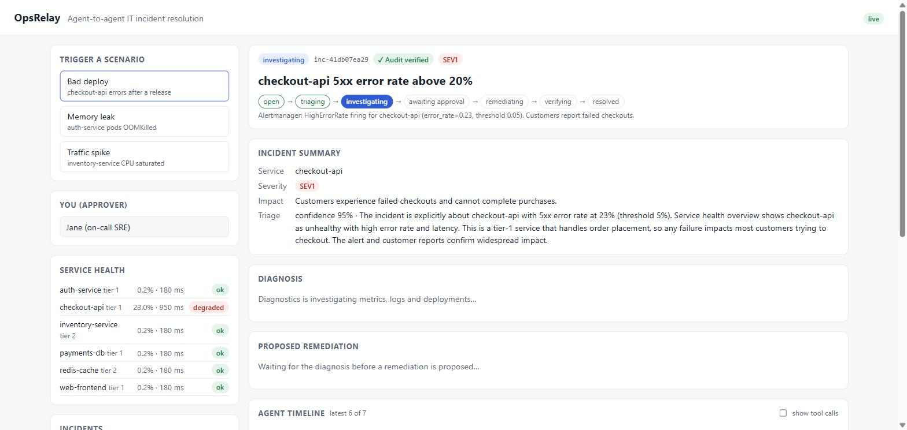

Clicking **Bad deploy** breaks `checkout-api` (23% errors, 950 ms p99) and opens an incident.
The header shows its status, id, a **✓ Audit verified** badge and severity, and the **lifecycle
bar** shows where it is: `open → triaging → investigating → awaiting approval → remediating →
verifying → resolved`. The coordinator has sent it to the **triage** agent, which returned a typed
`TriageResult` (SEV1, customer impact, 95% confidence); the **Incident summary** shows it.
Diagnosis and remediation show what they're waiting for.

### 3. What happened, and why

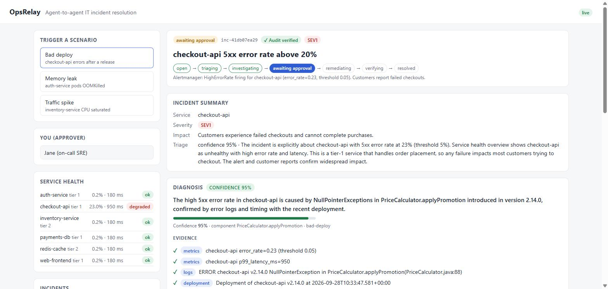

About 40 seconds after the alert, the incident is **awaiting approval**. The **diagnostics** agent
submitted a `DiagnosisResult`: a root cause, the component at fault, and a confidence of 95%.

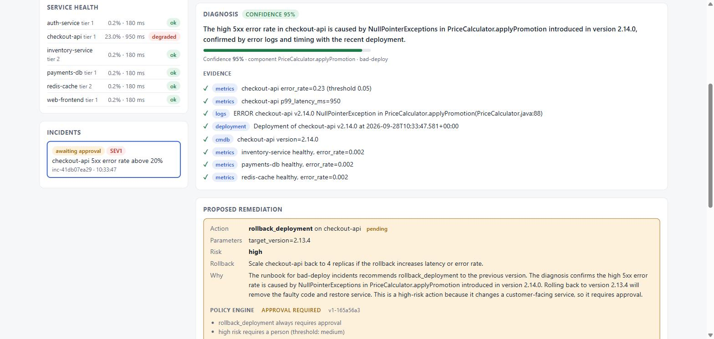

Every piece of **evidence** carries its source (metrics, logs, deployment, CMDB), so an operator
can check the reasoning at a glance: the error rate, the exception in the logs, the deploy that
lined up with the incident, and healthy dependencies ruling out other causes.

### 4. What OpsRelay wants to do, and who must approve it

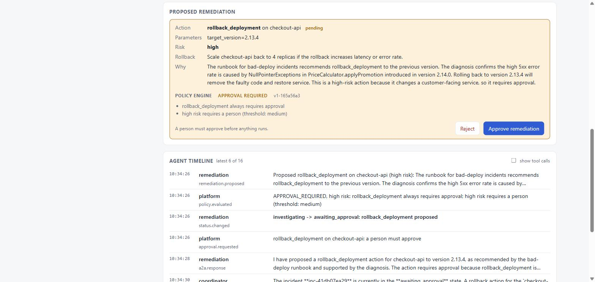

The **remediation** agent proposed `rollback_deployment` to `target_version=2.13.4`, with its own
risk estimate, a rollback plan and its reasoning. The agent can't run it. The **policy engine**
evaluated the proposal first and says why a person is needed: *rollback_deployment always requires
approval* and *high risk requires a person*. Only then do **Reject** and **Approve remediation**
appear.

### 5. Fixed, verified and written up

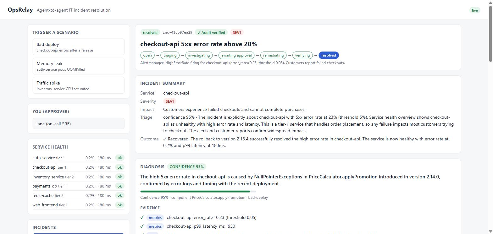

After **Approve remediation**, the incident walks through `remediating` and `verifying` to
`resolved`. The **verification** agent, not the one that proposed the fix, checked the metrics
(0.2% errors, 180 ms), and the platform cross-checked its claim against live metrics. The outcome
appears in the summary.

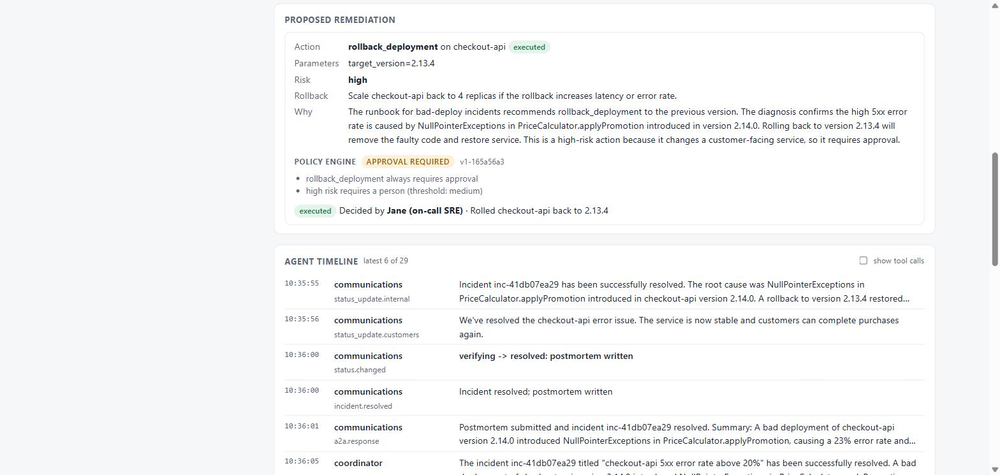

The remediation card records who decided and what happened: *Decided by Jane (on-call SRE) · Rolled
checkout-api back to 2.13.4*. The execution engine ran it once, under an idempotency key, so a
retry could never roll back twice. Below it, the timeline shows the **latest events only**:
communications posted an internal update and a customer update, then submitted the postmortem.

### 6. What the agents actually did

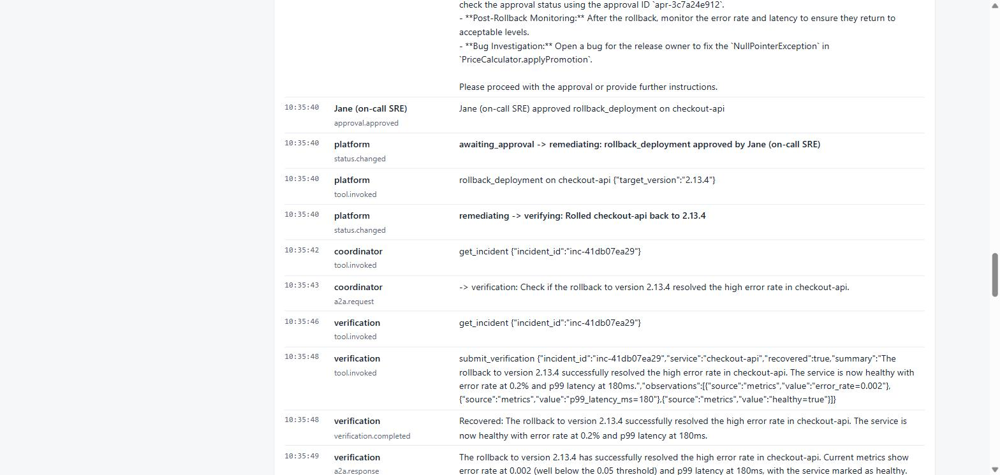

Click **Show all events** and tick **show tool calls** to see everything: the approval, each
status change (in bold), the platform's execution with its parameters, and the verification agent's
typed submission.

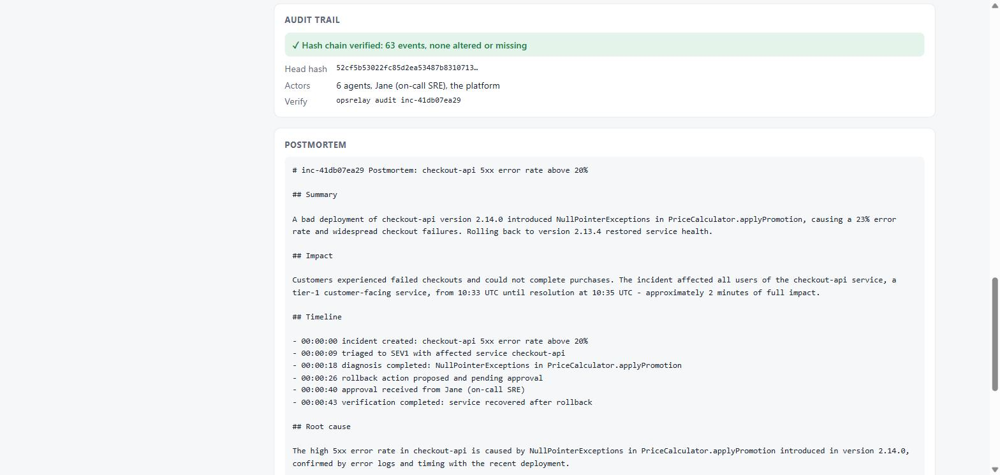

The **Audit trail** confirms the log hasn't been altered: each of the 63 events stores the hash of
the one before it, so a changed or deleted event breaks the chain (`opsrelay audit <id>` checks it
from the command line). The **Postmortem** was submitted as a typed `Postmortem` with summary,
impact, timeline, root cause, resolution, contributing factors, detection and action items.

### 7. When a person says no

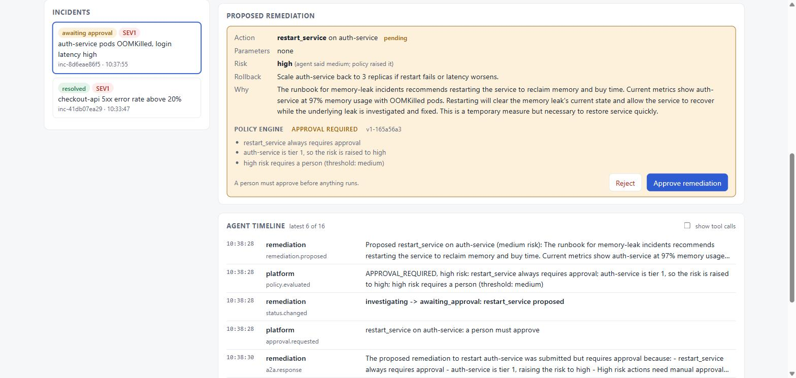

In the **Memory leak** run, remediation proposed `restart_service` and rated it *medium* risk. The
policy raised it to **high** (*auth-service is tier 1*), and the card says so: *agent said medium;
policy raised it*. Agents can raise a risk rating but never lower it.

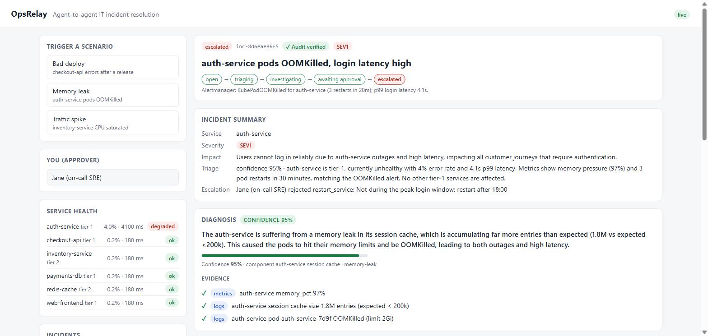

The approver clicked **Reject**: *"Not during the peak login window; restart after 18:00"*.
Nothing ran. The incident moved from `awaiting approval` straight to `escalated`, the only legal
move after a rejection, and the lifecycle bar shows the path it actually took. The reason is kept as
the escalation reason, attributed to the approver, and communications posted an internal update.

### 8. When the policy says a person isn't needed

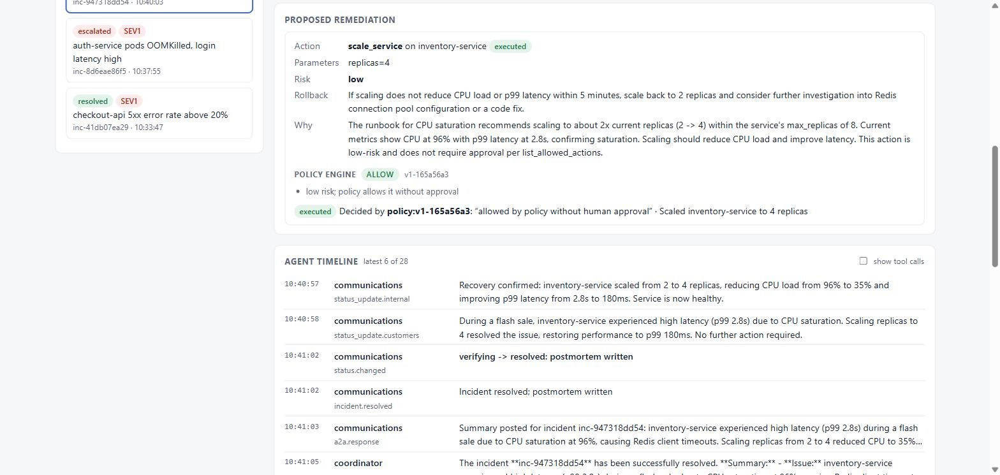

In the **Traffic spike** run, remediation proposed scaling `inventory-service` from 2 to 4
replicas. Scaling a tier-2 service is **low** risk, and the policy says it doesn't need a person
(**ALLOW**), so the platform approved it on the policy's behalf (*Decided by policy:v1-…*), ran
it, verified recovery and resolved the incident about a minute after the alert. The same policy
file decides this for every action; change it and the behavior changes, with no code changes.

## How the governance layer works

Every piece is enforced by the platform, whatever the model does:

- **A state machine.** Incidents move only `open → triaging → investigating → awaiting_approval →
  remediating → verifying → resolved`, or to `failed` and `escalated`. Every move is checked and
  written atomically; nothing can change status any other way.
- **Typed agent contracts.** Each agent submits a pydantic-validated result (`TriageResult`,
  `DiagnosisResult` with evidence and confidence, `RemediationProposal` with a rollback plan,
  `VerificationResult`, `Postmortem`). Invalid output goes back to the agent with the errors. Each
  agent acts only in its own states and gets only its own tools.
- **A policy engine** (`opsrelay/policies.yaml`): ALLOW, APPROVAL_REQUIRED or DENY for every
  proposal, with reasons. `delete_database` is never allowed; scaling a tier-2 service runs without
  a person; a diagnosis below 70% confidence can't be acted on, and below 90% always needs a person.
- **Propose, approve, execute and verify are separate.** A dedicated verification agent judges the
  outcome, and the execution engine runs each action once per idempotency key.
- **Resilience.** Timeouts, retries with backoff, a circuit breaker per agent, a dead-letter queue,
  and escalation to a person when an agent stays down.
- **A tamper-evident audit log.** Each event carries the hash of the one before it.

## How to use it

**In the dashboard** (after `opsrelay up`, at http://127.0.0.1:8080/):

1. Enter your name under **You (approver)**.
2. Click a scenario.
3. Wait for the yellow **Proposed remediation** card (usually 30 to 60 seconds with a real model).
4. Read the diagnosis, the evidence and the policy engine's reasons. Then **Approve remediation**,
   or **Reject** with a reason.
5. Watch it verify and resolve. Read the postmortem at the bottom; the audit trail above it
   shows whether the record is intact.

**From the command line** (same coordinator, same incidents):

```powershell
$env:OPSRELAY_URL="http://127.0.0.1:8080"
opsrelay simulate bad-deploy                         # open an incident; agents run until approval
opsrelay approvals                                   # list pending approvals
opsrelay approve apr-xxxxxxxxxx --by <you>           # or: reject ... --note "why"
opsrelay show inc-xxxxxxxxxx                         # full timeline and postmortem
```

**Choosing the model:**

| Mode | Set | Good for |
|---|---|---|
| Offline (default) | nothing | Demos, tests and CI. Free, and the same result every time. |
| Amazon Nova 2 Lite | `OPSRELAY_MODEL_PROVIDER=bedrock` | Real AI reasoning at low cost, no AWS Marketplace subscription needed |
| Claude on Bedrock | also `OPSRELAY_BEDROCK_MODEL_ID=global.anthropic.claude-...` | If your account has Claude access |

**Where it runs:** on your machine with `opsrelay up`, on an EC2 instance
([deploy/ec2/user-data.sh](../deploy/ec2/user-data.sh)), or on Amazon Bedrock AgentCore with
the CDK stack in `infra/` (API only, no dashboard).

## Why it's useful

- **Minutes of first response, done in seconds.** Checking dashboards, reading logs, lining up
  deploy times and finding the runbook is the slow part of the first 15 minutes of an incident.
  The agents had a root cause, evidence and a proposed fix about 30 seconds after the alert.
- **People stay in control.** Agents investigate and propose; only a person can make a change.
  The policy engine decides which actions need a person, and a rejection stops everything
  ([section 7](#7-when-a-person-says-no)).
- **Runbooks get used.** Remediation starts from the runbook for the incident type, so fixes are
  consistent no matter who is on call.
- **A complete audit trail.** Every agent handoff, tool call and human decision is recorded with
  who made it. That's useful for reviews, compliance and learning.
- **Postmortems write themselves.** A first draft exists the moment the incident closes, built
  from the real timeline, not from memory days later.
- **Specialists you can swap.** Each agent is a separate A2A service. You can replace one, add a
  new specialist (such as a security or database agent), or plug in any A2A-compatible agent
  from another platform, without touching the others.
- **Not tied to one model.** The same agents run on Amazon Nova, Claude, or offline, by changing
  one setting.

It's a demo: the services, metrics, logs and actions are simulated. See the next section for
what it would take to use it on real systems.

## How it could be improved

Ideas grouped by what they'd fix. Typed contracts, the policy engine, confidence thresholds,
a proposal limit, a verification agent, idempotent execution, retries and dead letters, and a
hash-chained audit log are already done (see [How the governance layer works](#how-the-governance-layer-works)).

**Safety and correctness**

- **Flag proposals that go against the runbook.** In an earlier memory-leak run the agent
  proposed scaling when the runbook said restart. The platform could compare each proposal with the
  runbook's recommended action and show a warning on the approval card, or require a second
  approver when they differ.
- **Evaluate models against the scenarios.** A small evaluation suite could run every scenario
  against a real model many times and score whether the diagnosis and proposed action were right.
  It would have caught the scaling mistake before a person had to, and it's how to compare Nova,
  Claude and future models fairly.
- **Log in to the dashboard.** The dashboard has no login today, so the EC2 setup restricts it to
  one IP address. Adding sign-in (for example Amazon Cognito, or an AgentCore JWT authorizer)
  would make the approver's name come from a verified identity, not a text box.
- **Guardrails.** Add Bedrock Guardrails on the model.
- **Roles.** Viewer, operator, incident commander, SRE, admin and auditor roles, so only some
  people can approve high-risk actions or change the policy.

**Connect it to real systems**

- **Real connectors.** Implement the `Environment` interface (`opsrelay/environment.py`) for
  CloudWatch metrics and logs, a real service catalog (CMDB) and a deploy tool such as CodeDeploy
  or Argo CD.
- **Real alerts.** Accept alert webhooks from Alertmanager, or CloudWatch alarms through
  EventBridge, in place of the scenario buttons.
- **Approve from chat.** Post the approval card to Slack or Teams with Approve and Reject buttons
  that call the same `decide_approval` API.
- **Publish updates.** Send the communications agent's updates to a status page and email,
  instead of only recording them.

**Dashboard**

- **Live updates instead of polling.** The page re-fetches everything every 1.5 seconds and
  redraws it, which makes text hard to select. Server-sent events would update only what
  changed.
- **History and metrics.** Time to diagnose, time to approve, time to resolve, and how often
  proposals are approved or rejected, per scenario and per model.

**Intelligence**

- **Runbook search and incident memory.** Retrieve relevant runbooks and similar past incidents
  (with their postmortems and rejection notes) for diagnosis and remediation, so a correction only
  has to be made once.
- **Replay.** Re-run a recorded incident against a new agent or model version and compare.

**Running it**

- **Durable state on EC2.** The EC2 setup keeps its data in SQLite on the instance disk. Pointing
  it at DynamoDB (already supported with `OPSRELAY_STORE=dynamodb`) keeps incidents if the
  instance is replaced.
- **HTTPS.** Put the dashboard behind an Application Load Balancer or CloudFront with a
  certificate.
- **A model per agent.** Use a cheap, fast model for triage and communications, and a stronger
  one for diagnostics and remediation.
- **Automatic output limits.** Nova Pro allows at most 10,000 output tokens; the agents default
  to 16,000. OpsRelay could look up each model's limit instead of relying on
  `OPSRELAY_MAX_TOKENS`.
