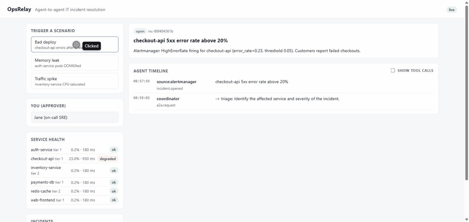
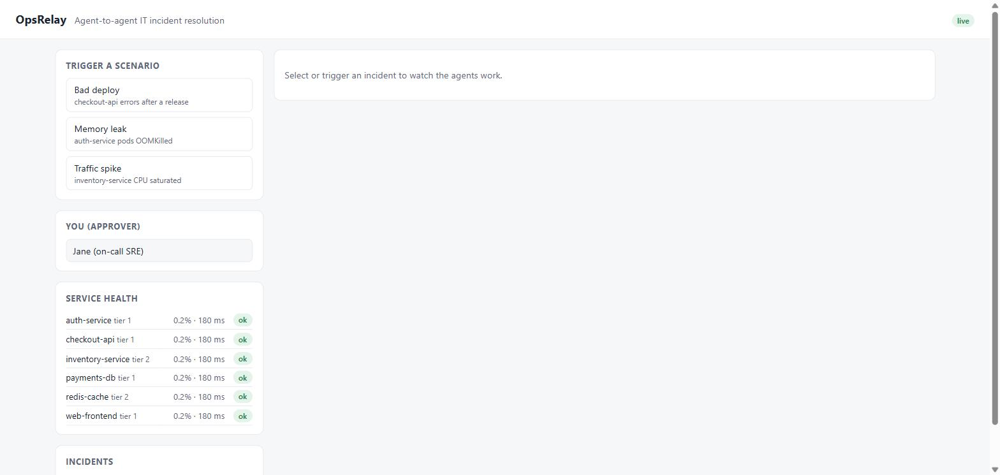
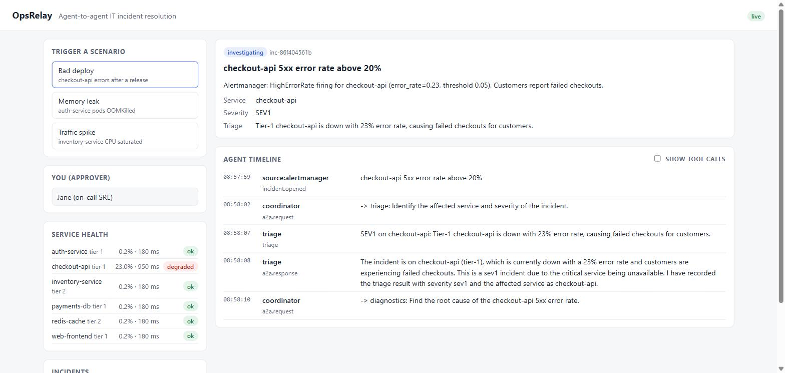
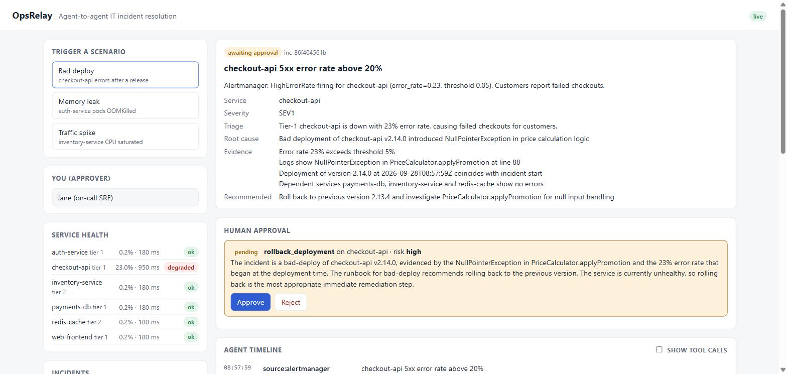
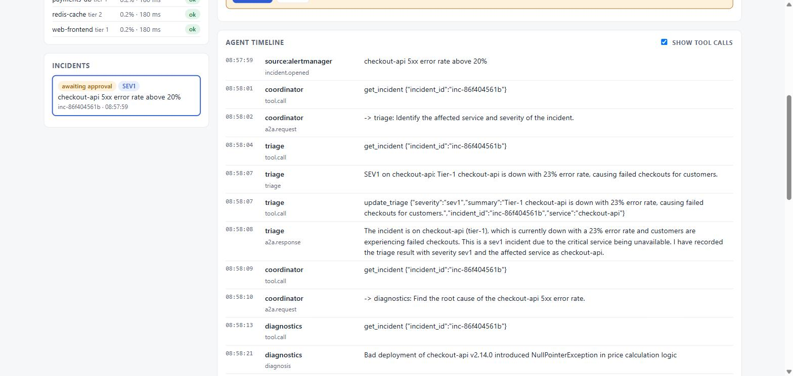
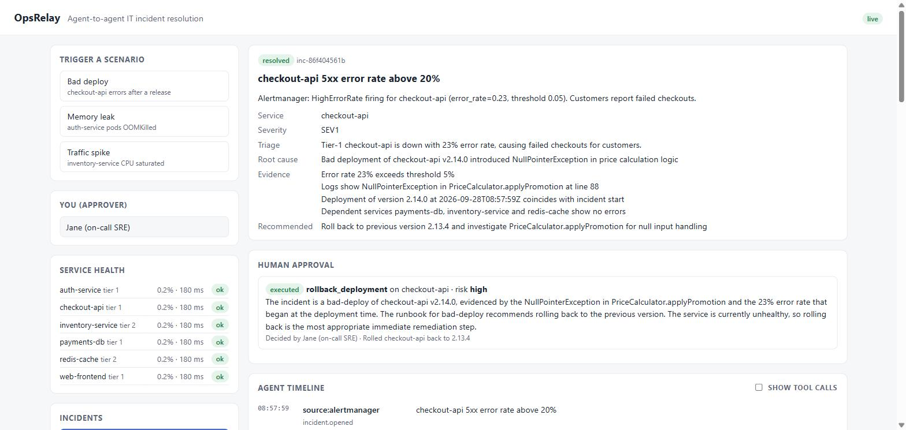
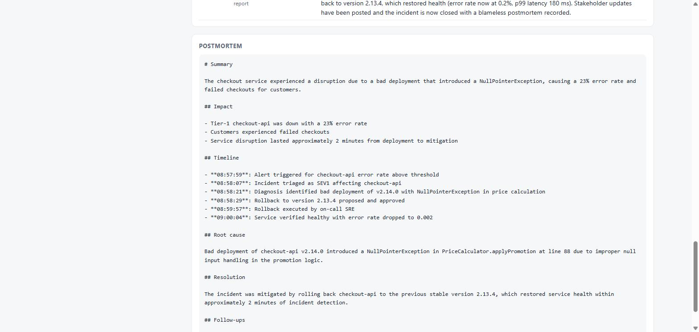
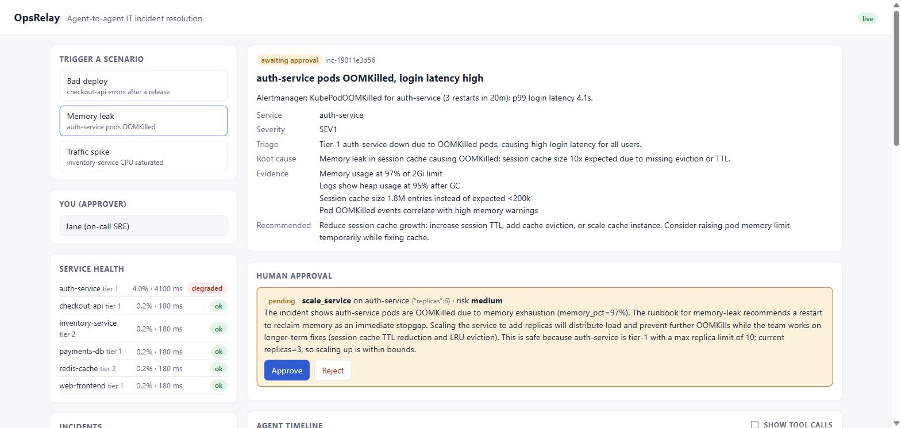
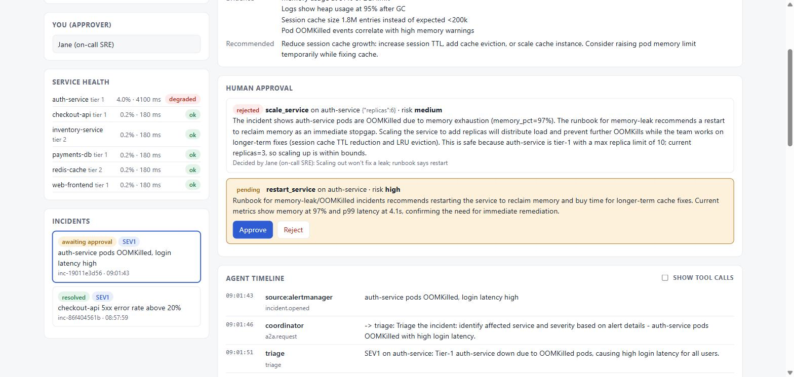
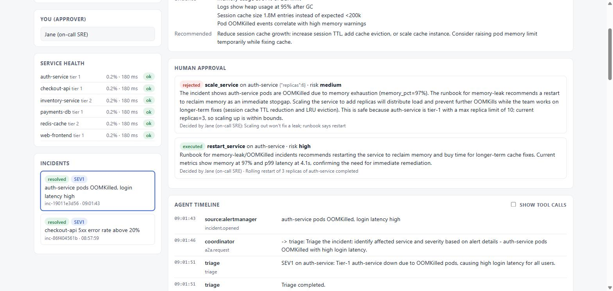

# OpsRelay user guide

What OpsRelay looks like in use, step by step, why it's useful, and where it could go next.

Every screenshot below is from a real run: `opsrelay up` with the agents on **Amazon Nova 2 Lite**
through Amazon Bedrock. Nothing was scripted or edited; the agents wrote every sentence you see.
(To install and start OpsRelay, see [WALKTHROUGH.md](WALKTHROUGH.md).)



## Contents

- [The workflow in pictures](#the-workflow-in-pictures)
  - [1. The dashboard](#1-the-dashboard)
  - [2. An alert fires and the agents take over](#2-an-alert-fires-and-the-agents-take-over)
  - [3. A person decides](#3-a-person-decides)
  - [4. Every step is on the record](#4-every-step-is-on-the-record)
  - [5. Fixed, verified and written up](#5-fixed-verified-and-written-up)
  - [6. When the agents get it wrong](#6-when-the-agents-get-it-wrong)
- [How to use it](#how-to-use-it)
- [Why it's useful](#why-its-useful)
- [How it could be improved](#how-it-could-be-improved)

## The workflow in pictures

### 1. The dashboard



Everything on one page:

- **Trigger a scenario** injects a realistic fault into the simulated environment, as if an alert
  had fired: a bad deploy, a memory leak or a traffic spike.
- **You (approver)** is your name. Every approval or rejection is recorded with it.
- **Service health** shows the six simulated services, their error rate and p99 latency.
- **Incidents** lists every incident and its status.

### 2. An alert fires and the agents take over



Clicking **Bad deploy** breaks `checkout-api` (health turns *degraded*: 23% errors, 950 ms p99)
and opens an incident from the alert. From here nobody touches anything:

1. The **coordinator** agent sends the incident to the **triage** agent over A2A.
2. **Triage** reads service health and the service catalog, rates it **SEV1** (checkout is a
   tier-1 service) and reports back.
3. The coordinator hands it to **diagnostics** to find the root cause.

Each specialist is a separate A2A server, the same as when deployed on Bedrock AgentCore.

### 3. A person decides



About 30 seconds after the alert:

- **Diagnostics** has found the root cause (release 2.14.0 introduced a `NullPointerException`)
  and listed its evidence: the error rate, the log line, the deploy time lining up with the
  incident, and healthy dependencies.
- **Remediation** looked up the `bad-deploy` runbook and proposed `rollback_deployment`,
  rated **high risk** because checkout is tier 1.

The yellow card is the **human approval gate**. The agents cannot run the rollback themselves:
`propose_action` only records a request. The platform executes it after a person clicks
**Approve**, and that rule is enforced in code, not in a prompt.

### 4. Every step is on the record



The **Agent timeline** shows each A2A request and response between agents. Tick
**show tool calls** to also see every tool each agent called and its exact input. This is the
audit log: it's append-only and records who (or which agent) did what, and when.

### 5. Fixed, verified and written up



After **Approve**:

1. The platform rolls `checkout-api` back to 2.13.4, recorded as *Decided by Jane (on-call SRE)*.
2. **Remediation** checks the metrics and confirms recovery (0.2% errors, 180 ms).
3. **Communications** posts an internal update and a customer-facing update, then resolves the
   incident.



It also writes a **blameless postmortem**: summary, impact, timeline, root cause, resolution
and follow-ups. From alert to postmortem took about two and a half minutes, most of it waiting
for the human.

### 6. When the agents get it wrong

The approval gate isn't a formality. In the **Memory leak** run, the agents made a mistake:



Diagnostics correctly found a memory leak in the session cache, and remediation's own
rationale says *the runbook recommends a restart*. But it proposed `scale_service` to 6
replicas instead. More replicas of a leaking service just leak more memory.



The approver clicked **Reject** with the reason *"Scaling out won't fix a leak; runbook says
restart"*. The coordinator is allowed one alternative after a rejection, so it asked
remediation again, which proposed `restart_service`, the runbook's fix.



The restart was approved and executed, auth-service recovered, and the incident was resolved.
Nothing ran without a person saying yes, and the reviewer's note steered the agents to the
right fix. If the second proposal had also been wrong, rejecting it would have escalated the
incident to the owning team.

## How to use it

**In the dashboard** (after `opsrelay up`, at http://127.0.0.1:8080/):

1. Enter your name under **You (approver)**.
2. Click a scenario.
3. Wait for the yellow **Human approval** card (usually 20 to 40 seconds with a real model).
4. Read the root cause, evidence and rationale. Then **Approve**, or **Reject** with a reason.
5. Watch it verify and resolve. Read the postmortem at the bottom.

**From the command line** (same coordinator, same incidents):

```powershell
$env:OPSRELAY_URL="http://127.0.0.1:8080"
opsrelay simulate bad-deploy                         # open an incident; agents run until approval
opsrelay approvals                                   # list pending approvals
opsrelay approve apr-xxxxxxxxxx --by <you>           # or: reject ... --note "why"
opsrelay show inc-xxxxxxxxxx                         # full timeline and postmortem
```

**Choosing the model:**

| Mode | Set | Good for |
|---|---|---|
| Offline (default) | nothing | Demos, tests and CI. Free, and the same result every time. |
| Amazon Nova 2 Lite | `OPSRELAY_MODEL_PROVIDER=bedrock` | Real AI reasoning at low cost, no AWS Marketplace subscription needed |
| Claude on Bedrock | also `OPSRELAY_BEDROCK_MODEL_ID=global.anthropic.claude-...` | If your account has Claude access |

**Where it runs:** on your machine with `opsrelay up`, on an EC2 instance
([deploy/ec2/user-data.sh](../deploy/ec2/user-data.sh)), or on Amazon Bedrock AgentCore with
the CDK stack in `infra/` (API only, no dashboard).

## Why it's useful

- **Minutes of first response, done in seconds.** Checking dashboards, reading logs, lining up
  deploy times and finding the runbook is the slow part of the first 15 minutes of an incident.
  The agents had a root cause, evidence and a proposed fix about 30 seconds after the alert.
- **People stay in control.** Agents investigate and propose; only a person can make a change.
  The run in [section 6](#6-when-the-agents-get-it-wrong) shows why that matters.
- **Runbooks get used.** Remediation starts from the runbook for the incident type, so fixes are
  consistent no matter who is on call.
- **A complete audit trail.** Every agent handoff, tool call and human decision is recorded with
  who made it. That's useful for reviews, compliance and learning.
- **Postmortems write themselves.** A first draft exists the moment the incident closes, built
  from the real timeline, not from memory days later.
- **Specialists you can swap.** Each agent is a separate A2A service. You can replace one, add a
  new specialist (such as a security or database agent), or plug in any A2A-compatible agent
  from another platform, without touching the others.
- **Not tied to one model.** The same agents run on Amazon Nova, Claude, or offline, by changing
  one setting.

It's a demo: the services, metrics, logs and actions are simulated. See the next section for
what it would take to use it on real systems.

## How it could be improved

Ideas grouped by what they'd fix. The first three came straight out of the runs above.

**Safety and correctness**

- **Flag proposals that go against the runbook.** In the memory-leak run the agent proposed
  scaling when the runbook said restart. The platform could compare each proposal with the
  runbook's recommended action and show a warning on the approval card, or require a second
  approver when they differ.
- **Evaluate models against the scenarios.** A small evaluation suite could run every scenario
  against a real model many times and score whether the diagnosis and proposed action were right.
  It would have caught the scaling mistake before a person had to, and it's how to compare Nova,
  Claude and future models fairly.
- **Log in to the dashboard.** The dashboard has no login today, so the EC2 setup restricts it to
  one IP address. Adding sign-in (for example Amazon Cognito, or an AgentCore JWT authorizer)
  would make the approver's name come from a verified identity, not a text box.
- **Guardrails.** Add Bedrock Guardrails on the model, and cap how many actions an incident can
  run.

**Connect it to real systems**

- **Real connectors.** Implement the `Environment` interface (`opsrelay/environment.py`) for
  CloudWatch metrics and logs, a real service catalog (CMDB) and a deploy tool such as CodeDeploy
  or Argo CD.
- **Real alerts.** Accept alert webhooks from Alertmanager, or CloudWatch alarms through
  EventBridge, in place of the scenario buttons.
- **Approve from chat.** Post the approval card to Slack or Teams with Approve and Reject buttons
  that call the same `decide_approval` API.
- **Publish updates.** Send the communications agent's updates to a status page and email,
  instead of only recording them.

**Dashboard**

- **Live updates instead of polling.** The page re-fetches everything every 1.5 seconds and
  redraws it, which makes text hard to select. Server-sent events would update only what
  changed.
- **Show the reviewer's feedback.** When a rejection note leads to a new proposal, link the two
  on the card so it's clear which feedback led to the new proposal.
- **History and metrics.** Time to diagnose, time to approve, time to resolve, and how often
  proposals are approved or rejected, per scenario and per model.

**Running it**

- **Durable state on EC2.** The EC2 setup keeps its data in SQLite on the instance disk. Pointing
  it at DynamoDB (already supported with `OPSRELAY_STORE=dynamodb`) keeps incidents if the
  instance is replaced.
- **HTTPS.** Put the dashboard behind an Application Load Balancer or CloudFront with a
  certificate.
- **A model per agent.** Use a cheap, fast model for triage and communications, and a stronger
  one for diagnostics and remediation.
- **Automatic output limits.** Nova Pro allows at most 10,000 output tokens; the agents default
  to 16,000. OpsRelay could look up each model's limit instead of relying on
  `OPSRELAY_MAX_TOKENS`.
