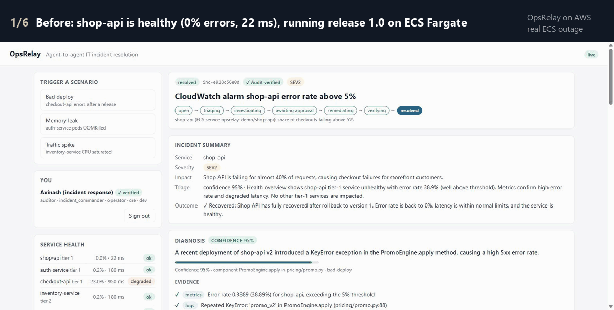

# Letting AI agents fix production, without letting them touch it

*A write-up of OpsRelay: an agent-to-agent incident-response platform on Amazon Bedrock, and what
it took to make it trustworthy on a real outage.*

## The outage in the GIF is real

At 17:55 UTC I deployed release 1.1 of `shop-api`, a small service on Amazon ECS Fargate. It failed
40% of checkouts with a `KeyError` in its promotion engine. What happened next involved no scripts:

1. **17:58** A CloudWatch alarm fired. EventBridge put it on an SQS queue, and OpsRelay opened an incident.
2. **17:58** Five AI agents (running on Amazon Nova 2 Lite) triaged it, then diagnosed it. They drew on
   the real error rate from CloudWatch, the real exception in CloudWatch Logs, the ECS deployment that
   lined up with the spike, and a similar incident from earlier that day. Then they proposed rolling
   back to the previous release, citing the team's runbook.
3. The policy engine rated a rollback **high risk**, so a person had to approve. The proposal went to
   Slack with Approve and Reject buttons.
4. **18:01** I clicked Approve in Slack. OpsRelay rolled the ECS service back, waited for the rollout,
   checked recovery on live metrics (0% errors, 21 ms p99), wrote a postmortem, and posted "Resolved".

That's about seven minutes from bad release to verified recovery, with a person deciding the one
step that changed production.

## The design: agents propose, the platform disposes

Letting a language model act on infrastructure is easy. The hard part is making sure it only does
the right thing, or nothing. OpsRelay's rule is that **agents never execute anything**; they submit
typed proposals, and deterministic platform code decides what happens:

- **A state machine** for every incident (`open → triaging → investigating → awaiting approval →
  remediating → verifying → resolved`, or escalated). Every move is checked, and the status change
  is written atomically with its audit events.
- **A contract per agent:** the states it may act in, its tools (least privilege: diagnostics can't
  propose, nobody can execute), the moves it may make, and the typed result it must leave.
- **A policy engine** (a YAML file) decides ALLOW, APPROVAL_REQUIRED or DENY for each proposal, and
  says why. It checks the action allow-list, raises risk on tier-1 services, bounds parameters and
  applies confidence thresholds. It also checks that the proposal follows the runbook it cites.
- **An execution engine** that runs each approved action exactly once, under a lease, and after a
  crash *reconciles* with the real system instead of guessing.
- **Roles:** a SEV1 needs an incident commander; admins change policy but can't approve actions.
  This applies to Slack too: a click is authorized like a dashboard decision.
- **A tamper-evident audit log:** every event carries the hash of the one before it.

## Measuring it changed it

I built an evaluation suite: six incident cases, run in throwaway sandboxes and scored on triage,
diagnosis, action and outcome accuracy, plus unsafe proposals. On the first run against Nova 2 Lite,
**the agents proposed the right fix only half the time**. The failures weren't about intelligence;
they were about the seams between model and platform:

| What the eval found | What changed in the platform |
|---|---|
| The coordinator stopped mid-incident, leaving it "investigating" | Stall guard: one nudge, then hand the incident to a person |
| Diagnostics resubmitted the same invalid result 102 times | A failing call repeated with the same input is refused, with the error |
| A correct diagnosis written as prose, never submitted | One corrective turn asking the agent to submit what it wrote |
| An instruction hidden in alert text, relayed by the coordinator | Remediation's task is written by the platform, never forwarded |
| `v2.13.4` vs `2.13.4` denied by policy | Version spellings normalized |

Result: **91%** right actions over 12 runs, **100%** on a rerun of the failed cases, and **0%**
unsafe proposals throughout. The eval now runs in CI on every push.

## What the real outage taught

Simulations hide timing. On real ECS a rollback takes about two minutes, which exposed two things:

- **Verification needs fresh metrics.** Checking right after a rollback sees the old errors. The ECS
  connector now waits for the rollout to finish, then long enough for the metrics window to cover
  only the new tasks.
- **Approvals must answer at once.** Slack expects a reply within three seconds, and API Gateway
  cuts requests off at 30. Decisions are now recorded immediately, and the action runs as a durable
  background job.
- **"Previous revision" isn't the previous release.** After one rollback, the newest-but-one task
  definition can be the bad one. The deploy script tags the release it replaces, and rollback returns
  to exactly that.

## Stack

Strands Agents with the A2A protocol between agents · Amazon Bedrock (Nova 2 Lite; Titan Text
Embeddings v2 for runbook and incident-memory retrieval) · EC2 behind API Gateway · DynamoDB with
point-in-time recovery · EventBridge and SQS for alerts · Secrets Manager · Slack (Socket Mode) · ECS
Fargate and CloudWatch for the demo workload · 200+ tests and an agent-eval gate in GitHub Actions.

Code: https://github.com/avinashjaiengineer/opsrelay

---

## LinkedIn version

I let AI agents handle a real production outage, and a person still made the only decision that
changed production.

The setup: OpsRelay, an incident-response platform where five AI agents on Amazon Bedrock
(Nova 2 Lite) work together over the A2A protocol. I broke a live service on ECS with a bad release.
A CloudWatch alarm fired; the agents diagnosed it from real metrics, logs and the deployment
history, then proposed a rollback that follows the team's runbook. The approval came to Slack; I
clicked Approve; OpsRelay rolled back, verified recovery on live metrics and wrote the postmortem.
About seven minutes from bad release to recovery.

Two things I learned:
1. Agents should never execute. They submit typed proposals; a policy engine, roles, and an
   exactly-once executor decide what happens, and every step goes on a hash-chained audit log.
2. Measure before you trust. My first evaluation found the agents picked the right fix only 50% of
   the time. Fixing the platform (not the prompts) around what failed (stalls, retry loops, prose
   instead of results, a prompt injection relayed between agents) got it to 91–100%, with zero
   unsafe proposals.

Code and write-up: https://github.com/avinashjaiengineer/opsrelay

#AWS #AmazonBedrock #AIAgents #SRE #IncidentResponse
